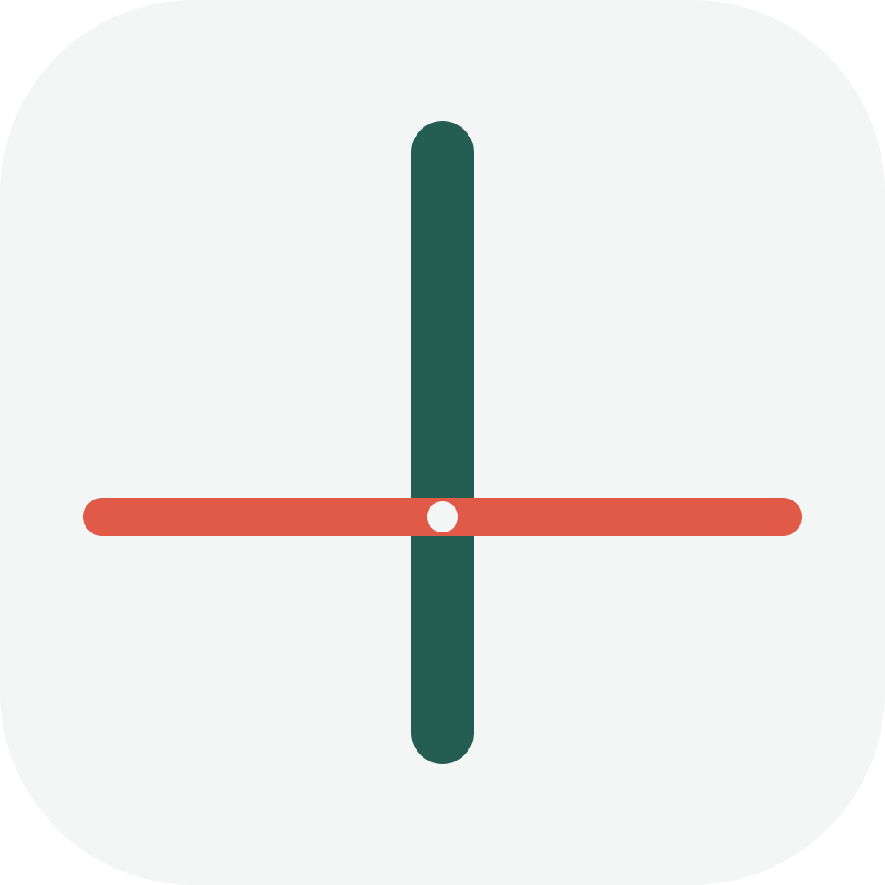
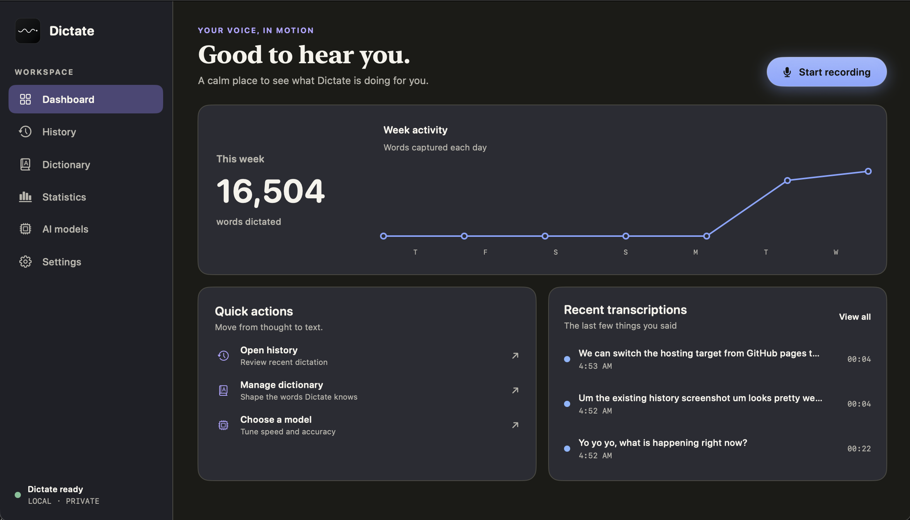
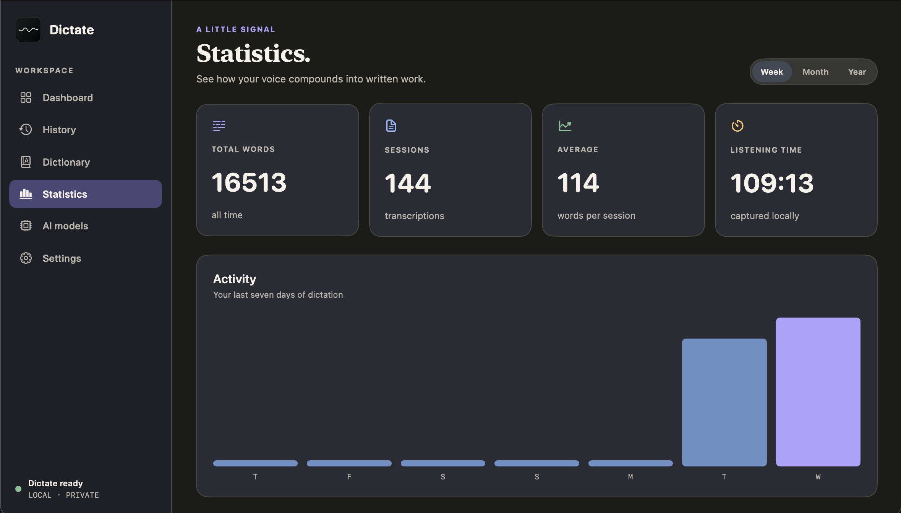

<p align="center">
  
</p>

<h1 align="center">Dictate</h1>

<p align="center">Hold a key. Say what you mean. Release and keep writing.</p>

<p align="center">
  <a href="https://github.com/leviackerman05/dictate/releases/latest/download/Dictate.dmg"></a>
  <a href="https://dictate-macos.vercel.app"></a>
  <a href="https://github.com/leviackerman05/dictate/releases"></a>
</p>

<p align="center">
  
  
  
  
</p>

<p align="center">
  
</p>

Dictate is a small macOS app for getting spoken words into the field you are
already using. Pick a shortcut, hold it while you speak, and release it to
finish. If Dictate cannot safely return the words to your current field, the
transcript stays available to copy instead.

Everything runs on your Mac. There is no account, analytics service, or stored
raw audio.

## Download

[Download the latest DMG](https://github.com/leviackerman05/dictate/releases/latest/download/Dictate.dmg), open it, and drag Dictate into Applications.

Dictate currently requires macOS 26 or newer on Apple silicon. Public builds are
distributed through GitHub Releases. Until they are Developer ID signed and
notarized, macOS may ask you to Control-click Dictate and choose **Open** the
first time.

## Using Dictate

1. Allow Microphone access. Allow Accessibility access if you want automatic
   insertion into other apps.
2. Choose a trigger key and either **Hold to talk** or **Click to toggle**.
3. Put the cursor in a text field, then dictate.
4. Review previous transcripts in History or teach Dictate names and preferred
   corrections in Dictionary.

Dictate supports Apple's on-device speech model, NVIDIA Parakeet, and Whisper.
Raw audio is only used for the active recording session and is never saved.

<p align="center">
  
</p>

## Build it locally

You will need Swift 6.2 or newer and the macOS 26 SDK.

```sh
swift test
swift build -c release --product Dictate
make app
```

The app bundle will be written to `build/Dictate.app`. To use your own bundle
identifier:

```sh
DICTATE_BUNDLE_IDENTIFIER=com.example.dictate make app
```

## Project notes

- [Privacy policy](PRIVACY.md)
- [Architecture](docs/ARCHITECTURE.md)
- [Design system](docs/DESIGN_SYSTEM.md)
- [Dictionary format](docs/DICTIONARY_SCHEMA.md)
- [Third-party notices](THIRD_PARTY_NOTICES.md)

Dictate is still early. If something behaves differently in a particular app,
please [open an issue](https://github.com/leviackerman05/dictate/issues) and say
which app and macOS version you were using.
