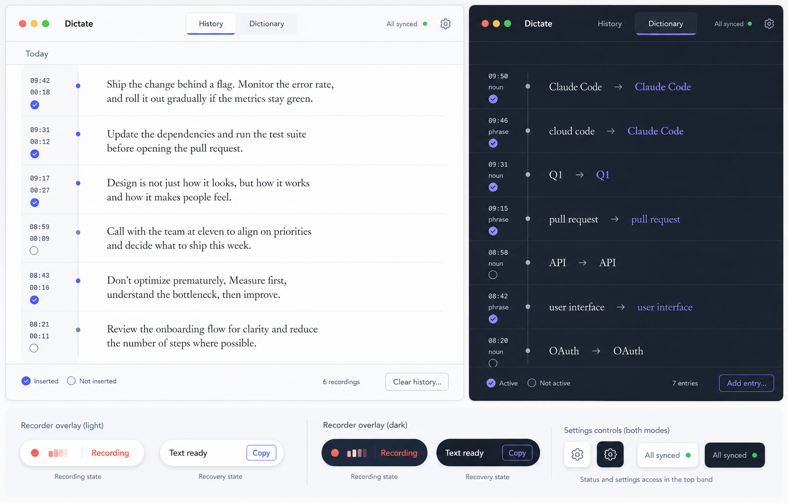
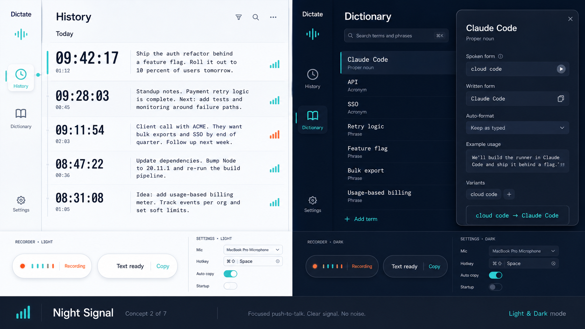
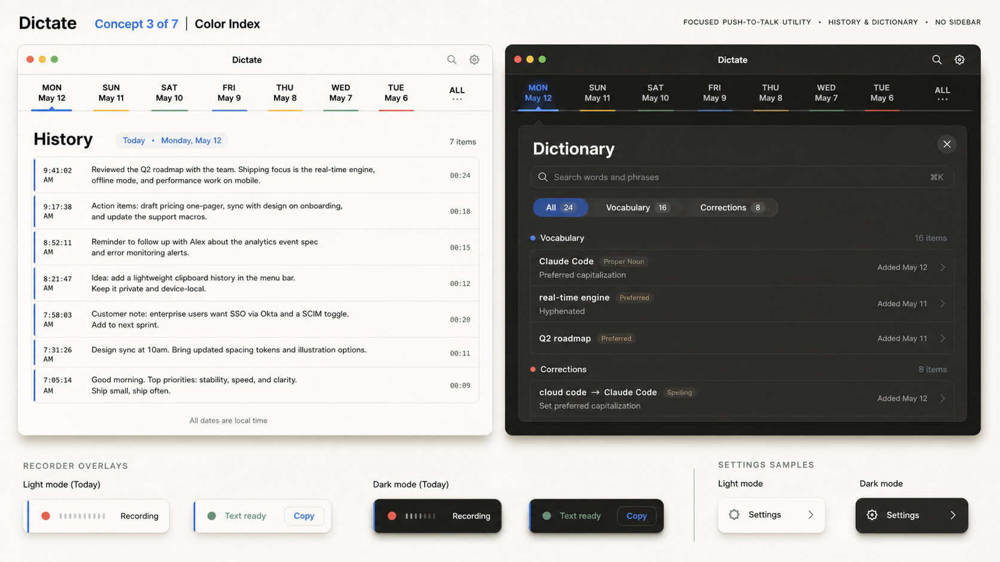
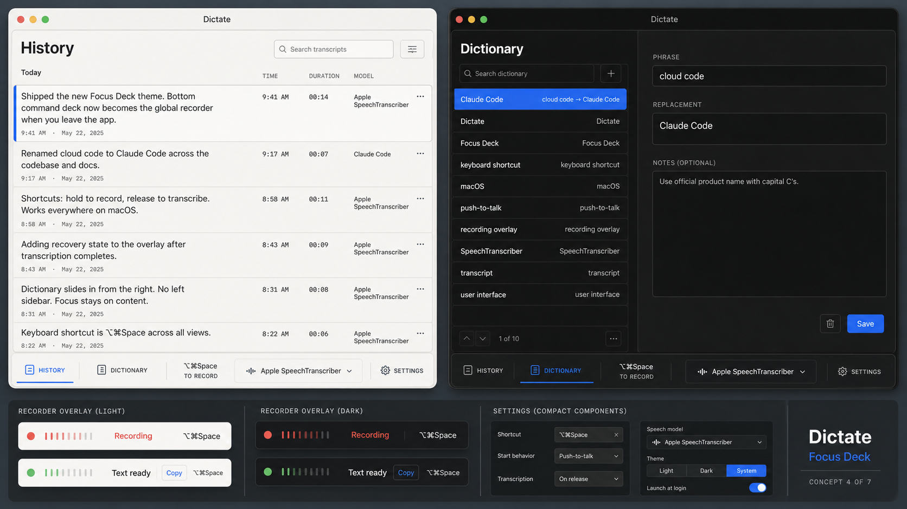
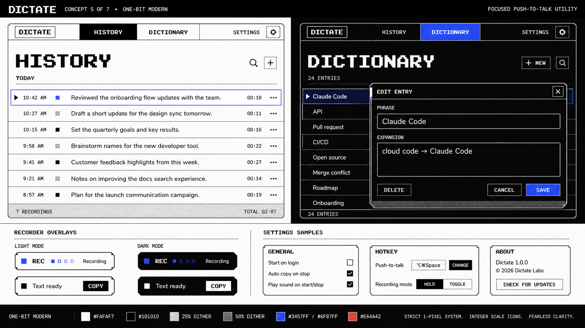
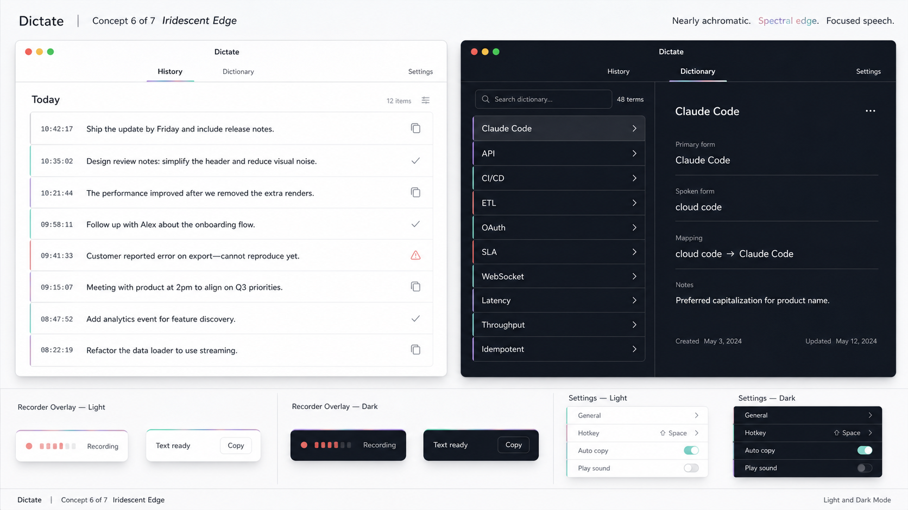
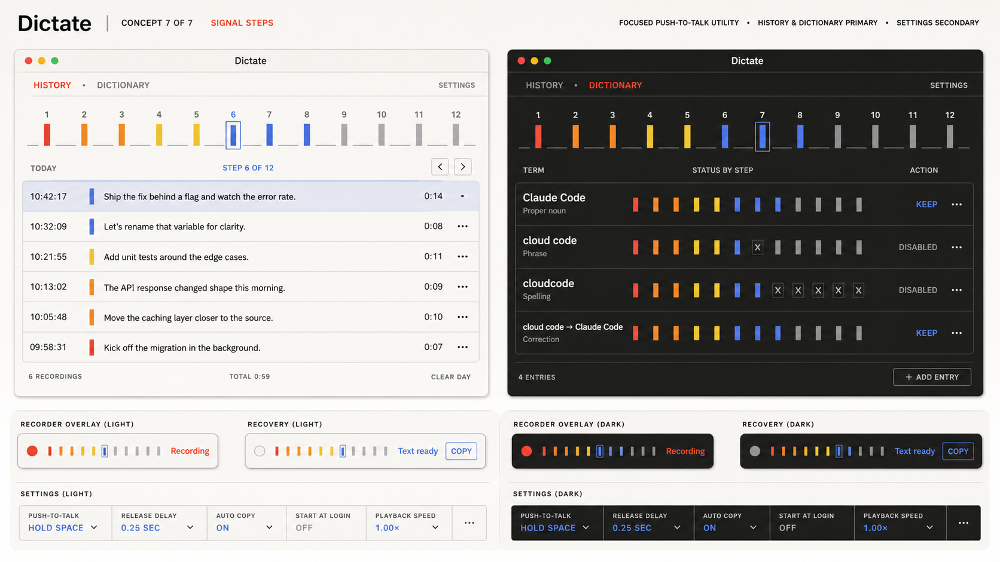

# Dictate theme concepts

> Archived exploration: these seven boards are no longer implementation choices.
> The approved consolidated design is in `../final-design/`; the shipped application
> is the source of truth for the current interface.

Seven complete visual directions were generated for comparison. Every board includes
a light-mode main surface, a dark-mode main surface, matching recorder overlays, and
supporting Settings controls.

The images are design references, not literal specifications of product copy. The
existing application remains the source of truth for behavior, labels, permissions,
models, and data.

## Concepts

### 1. Quiet Ribbon

Calm editorial stream, top navigation, and narrow metadata ribbons. Best for long,
comfortable reading with a recognizable but restrained identity.

### 2. Night Signal

Precise operational workspace, narrow icon rail, oversized time metadata, and a
high-performance dark mode. The most technical direction.

### 3. Color Index

Horizontal date index and restrained chronology colors inspired by reference
catalogs and transit systems. Expressive without becoming decorative.

### 4. Focus Deck

Compact landscape workspace with a persistent command deck that becomes the global
recorder when the main window is closed. The strongest standalone-product direction.

### 5. One-Bit Modern

Crisp black-and-white geometry, controlled dithering, pixel-display headings, and
modern readable body type. The boldest and most ownable identity.

### 6. Iridescent Edge

Nearly achromatic surfaces with a narrow mint/rose/violet optical edge. The quietest
premium direction and the easiest to keep visually calm.

### 7. Signal Steps

A colored step sequence turns recording cadence and chronology into the product's
signature. The most kinetic direction without becoming literal audio hardware.

## Historical selection method

First choose four concepts by number. Compare those four on daily readability,
distinctiveness, dark-mode quality, Dictionary usability, and recorder clarity. Then
choose one primary theme and optionally one secondary theme.

If two themes ship, they remain independent theme packs. They are not blended into a
hybrid. Each pack includes its own light and dark appearance.

## Generation approach

These boards were generated with the built-in image-generation tool as high-fidelity
desktop UI concept mockups. Each prompt fixed the same product scope and board layout,
then supplied that concept's structure, palette, typography, recorder states, and
avoid list. Shared requirements across all seven were:

- Dictate with History and Dictionary as the only primary destinations;
- Settings as a secondary surface;
- paired light and dark modes;
- compact recorder and recovery overlays with no live transcript;
- the exact states `Recording`, `Text ready`, and `Copy`;
- no notetaker, editor, generic dashboard, giant waveform, or microphone icon;
- production-level hierarchy and accessible contrast.

The final consolidated direction preserves Color Index's History and Dictionary
character, Focus Deck's Dictionary editor structure, and Quiet Ribbon's Settings
discipline. The old concept-specific specifications are not implementation authority.
